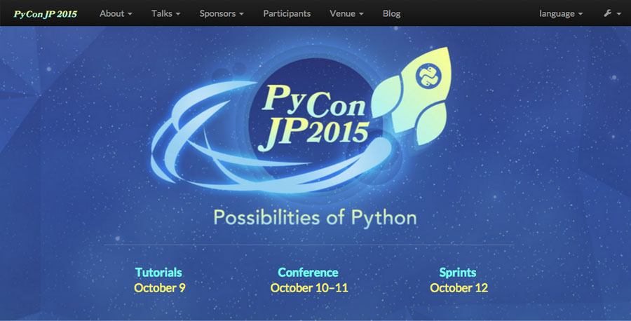
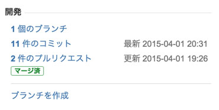
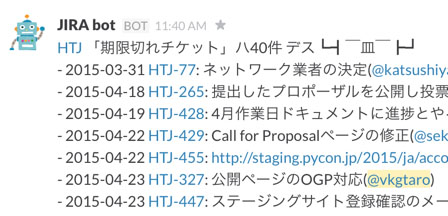

==========================================
PyCon JP 2015の作り方 〜メディアチーム編〜
==========================================

こんにちは。メディアチームの今津です。
PyCon JP 2015 では、現在4つのチームに分かれて様々な準備を行っています。この連載では、各チームがどのように PyCon JP 2015 を作っていっているのかを、それぞれの目線でご紹介していこうと思います。

第1回目は、同じメディアチームの担当である Web サイトについてご紹介します。

PyCon JP Web サイト開発について
===============================

PyCon JP 2015 Web 担当の小松です。
`2015年度版 Web サイト <https://pycon.jp/2015/ja/>`_ 開発の裏側について、PyCon JP の作り方と言うことで紹介していきたいと思います。

Symposion を使用したサイト開発
==============================

PyCon JP の Web サイトでは、2014年より Symposion を fork した PyCon 2014 をさらに fork して使用しています。

* `Symposion <http://eldarion.com/symposion/>`_

  * `github <https://github.com/pinax/symposion>`_

Symposion は、Django を使用して開発された CMS で、プロポーザルの応募などの機能がついていて、プロポーザルの内容の編集を応募者が行うことができ、レビュワーによるレビュー、採択から掲載までが行えるなど、カンファレンス向けとなっています。

PyConJP のスタッフは、 Python に関心が高い人が集まっていることもあり、Django 製のこの CMS はうってつけだったと思います。
私たちはこの symposion をさらに改良を加えて運用しており、そのソースコードは bitbucket で公開しています。

* `pyconjp-website <https://bitbucket.org/pyconjp/pyconjp-website>`_

2014年の段階で、いくつかの改良が加えられていましたが、今年はさらに来年以降も使い回しが効くようにハードコードを無くす方針で作業に取りかかりました。

機能要望のリストを作る
======================

PyCon JP は大きくプログラム、事務局、会場、メディアの四つのチームに分れており、 PyCon JP の Web サイトを開発するにあたって、各チームからの要望を集めました。

機能要望は優先度と大まかな期限を一緒に Google Spread sheet で受け付け、それを Web チームで jira にチケットとして登録していきました。一度運用されているシステムだけに、改善案も「ここがもっとこうだったら良いのに」といった内容が良く集まっていたように思えます。特に多かったのはやはりプログラムチームからのプロポーザル関連でしょうか。
システム的な改修としてはさほど大きくはないものの、プロポーザル応募フォームの項目の整理などは昨年の運用からの意見だったのがうかがえます。

大きな改修としては、次の三点が大きかったように思えます。

* 言語ごとのパーマリンクを作る
* プロポーザルが提出された段階で公開され、レビュー中のプロポーザルにソーシャルボタンで「いいね」などが出来るようにする
* facebook, twitter でもログイン出来るようにする

現在これらの機能は改修済みで公開しています。

受けた要望について、開発中の進捗管理、関係各所とのやりとりも基本的に jira で行い、必要に応じて slack で相談したり、毎月一度の作業日に聞いたりという形で進めました。
また、 slack や口頭で話した内容については必ず jira のチケットにメモを取るようにして、あとで「どうしてこうなったんだっけ？」と言うときに参照するようにしています。

一部の人を除いて、全員ボランティアで、プライベートな時間を使って作業を行っているので極力無駄な時間を取らないための対策でもありますね。

開発フローについて
==================

前述のとおり、 PyCon JP の Web サイトは bitbucket 上で git を使ってソースコード管理しています。そして、 jira と bitbucket を連携させて、ブランチ名を jira のチケット番号にすると該当チケットがひも付くようにしてあります。

   jiraチケット上でのbitbucket情報
	    
（jira のチケット上で関連コミットやブランチが見えてます。）

開発の基本的なイテレーション
----------------------------

開発する人たちと相談の上、 git flow に載せて開発しようと言うことになり、その上で、 チケット駆動開発になるようにどういったイテレーションで開発するのかをチームで共有しました。

1. 要望を jira でチケット化。担当が明確であればその人に、無ければチームリーダーの小松に回す。

   * ゴールと期日は明確に記述する。（ `Pythonプロフェッショナルプログラミング第2版 <http://www.amazon.co.jp/dp/479804315X>`_ 5章 p116 にあるテンプレートを使用しました。 ）

2. 自分が担当のチケットを受け取ったときに*進行中*に変更する。
3. 自分のリポジトリで feature branch を切って、作業開始する。

   * ブランチ名はチケット番号（HJT-XXX) にして jira との連携させる。

4. 作業が終わったら develop branch へマージする
5. 本家リポジトリに pull req を行い、チケットを解決にして小松へ返す。
6. 解決されているチケットがあったら、小松が確認の上、 pull req をマージしてチケットを閉じる。

   * もし、問題があったり、関係各所への確認が必要であれば、担当者をその人に回してチケットを再オープンし、解決されるまで 1. 〜 5. を繰り返す。

当初、6. の確認する人をリーダに一本化した方が良いのかは少し悩みましたが、確認できる人が回していくと言うふわっとした形にすると混乱するのではないか、と言うことで今の形に落ち着きました。
なぜ悩んだかは後述します。

チケットテンプレート
--------------------

齟齬をなるべくなくして、開発した機能について「コレジャナイ」と行った事が起きないように `Pythonプロフェッショナルプログラミング第2版 <http://www.amazon.co.jp/dp/479804315X>`_ の5章 p116 にあるテンプレートを採用しました。

.. code-block:: guess

   h2. 目的
   
   * この機能を実現することによってどんなことができるようになることを想定しているかを記載
   
   h2 入出力
   
   * 入力する値、出力される結果を記載
   
   h2. 関連機能、影響範囲
   
   * リグレッションの確認が必要となる箇所
   * この機能が使うデータを生成する機能(対象機能チケットへの関連付けでも可)
   * この機能が生成するデータを使う機能(対象機能チケットへの関連付けでも可)
   
   h2. セキュリティ
   
   * セキュリティ(権限など)がある場合は、その内容を記載
   
   h2. デモ方法
   
   * URLや、簡単に確認するための操作手順

3月初旬から4月初旬の短期決戦
----------------------------

機能要望が集まり、さぁ要望を整理しようと言ったのが `2/23 のスタッフ作業日 <http://pyconjp.connpass.com/event/12511/>`_ で、当初のサイト公開予定は3月中でした。
そこから、上述の開発フローが決まったのが 3/9 でしたので、かなりの短期決戦となりました。上がっていた要望の多くは機能改修と言うよりは文言修正で済むものが多かったとは言え、次に挙げるようなコアに関わる改修案件もあったので、週一でコアな開発メンバーで集まったりとなかなか濃密な1ヶ月になりました。

* 年度のハードコードを外す

  * 内部的には DB 名を決める部分など、システム的に中核な部分もありました

    * https://bitbucket.org/pyconjp/pyconjp-website/commits/61a681b65bb689c92e754f770d0114d36604ff6a?at=develop#Lpyconjp/settings/local.pyF48

  * CONFERENCE_ID を指定することで、何年度として動いているのかを設定出来るように。

* 言語ごとのパーマリンク

  * django-localeurl と言うモジュールを使うつもりでしたが要件にあわなかった。
  * 例年のディレクトリ構成に従って、 http://pycon.jp/2015/ をベースに http://pycon.jp/2015/ja/ としたかったが、 http://pycon.jp/ja/2015/ となってしまった。
  * django-localeurl に手を入れて、リポジトリに含める形にして対応。

    * https://bitbucket.org/pyconjp/pyconjp-website/src/6effd43062b4/localeurlcustom/?at=develop

  * reverse proxy としている nginx で rewrite の設定でつまずく。

* プロポーザル提出されたら公開機能

  * 当初提出されたら、一度レビュワーが公開しないと公開されないようにしていた。
  * 公開の手順が、レビュー通過と紛らわしかったので、提出されたら即公開するよう変更
  * 新たにレビュー中プロポーザルリストのページを作成

さらには年度末/新年度ということで、残念ながらちょうどこの期間中に作業できないメンバーが居たんですが、一般社団法人 PyCon JP から一ヶ月フルタイムで作業依頼されていた、 `株式会社シリアルゲームズ <http://www.serialgames.co.jp/>`_ の橋本さん ( `@yellow844 <https://twitter.com/yellow844>`_ ) にはお世話になりました。上述の課題もほとんど彼が開発しています。

.. 橋本さんはどこまで露出して良いのか分からなかったのですが、とりあえず載せられそうなものを全部書きました。確認の上削らせてください。
.. シリアルゲームズさんへのリンクはあると宣伝にもなって良いのかなぁと。

かくいう私はと言うと、年度末とは関係なかったのですが仕事で抱えてるプロジェクトのリリースが被っていたので、 pull req の確認とマージ、各所との連絡係という点では、ボトルネックになっていたのは言うまでもありません。これが pull req の確認係一本化についての懸念でしたが、期日については Slack のボットに突かれつつ、可能そうな期日に再設定をして乗り越えました。（PyCon JP の Slack には、チケット期限切れを通知する bot が居ます。）

   JIRA botによる期限の通知

関係各所と言えば、 Web 公開にあたって機能と同様に重要なのが Web デザインです。
デザインについてはデザインチームに依頼しており、何とも助かったのは Django のテンプレートを理解したチームでしたので直接コミットしてもらえたのは大きかったです。

今年のテーマは **Possibilities of Python** と言うことで、「Python の可能性」を感じられる Web デザインになっているかと思います。

無事公開！
----------

当初は4月上旬公開の予定でしたが、機能開発、デザインの組み込みを終え、コンテンツのいれ込みを行って、プログラムチームや事務局チームなど、他のチームと確認を行い、4/27 に Web サイト公開しました！

これから、この Web サイトを使って、2015年の PyCon JP について発信、そしてプロポーザルの募集を行って行けたらと思います。
今年の PyCon JP も是非皆さんで盛り上げていっていただければ幸いです！

まとめ
======

メディアチームの今津です。
このようにして PyCon JP 2015 の Web サイトが完成し、先日無事公開できました。今後もいろいろな情報を発信していきたいと考えています。

次回は、事務局チームの準備を担当者に紹介してもらう予定です。それでは、次回の更新をお楽しみに！
