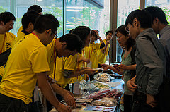
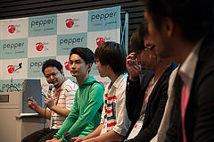
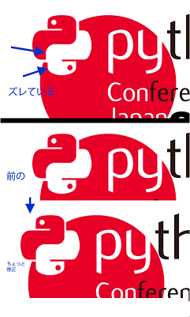
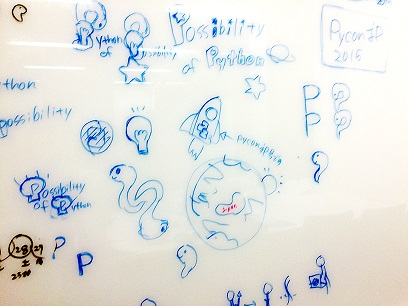

=================================
PyCon JP 2015の作り方
=================================

こんにちは。メディアチームの今津です。
PyCon JP 2015 では、現在4つのチームに分かれて様々な準備を行っています。この連載では、各チームがどのように PyCon JP 2015 を作っていっているのかを、それぞれの目線でご紹介していこうと思います。

第2回目は、事務局チームについてご紹介します。

事務局チームの役割
==================
PyCon JP 2015 事務局チームの吉田です。
カンファレンスを開くのに一番大切なのはコンテンツ(プログラムチーム)と場所(会場チーム)、告知(メディアチーム) であると考えています。
事務局チームはそれ以外の一切を行うことで、これもひとつの大きな役割だと思っています。
具体的な役割は、大きく以下の内容になります。

- 参加者の方々の登録、当日の受付や遠方からの来場者への費用支援に対応するなどの参加者管理。
- スポンサーの方々にスポンサード、出展いただくのに対応するスポンサー対応。
- イベントのロゴやサイト、冊子に使用されるイラストを作成するデザイン。
- Tシャツやストラップなどの来場者へのノベルティの準備。
- イベントの収入と支出全てに関係する会計。

この中からいくつか紹介します。

参加者管理のタスク
==================
参加者管理のタスクはPycon JPに参加される方全てに関わるタスクとなるので範囲が広いです。

外からは結構見えにくいタスクですが、全体を見て対応する必要があるので、やりがいのあるタスクです。
一般で参加される方、スピーカーの方でおよそ500人、それにスポンサー、業者の方、スタッフを含め600人以上に
スムーズに参加していただけるようにそれぞれ準備をしています。

一般で参加される方への参加窓口の案内が大きなタスクとしてあります。
connpassのページを用意し、その詳細説明用のページをPycon JP 2015のサイトに準備します。

今年はチケットの種類が、昨年の4種(Patron,通常早割,通常,学生)に比べて
7種(Patron,Business,Business早割,通常早割,通常,学生パーティ有り,学生パーティ無し)と増やしました。
昨年の開催後の参加者からのアンケートや座長の鈴木たかのりさんからの要望等に対応して今年はこのように増やしています。

これらチケット種類の金額、差別化、それぞれの枚数について設計することも参加者管理の大事なタスクです。
例えば今年増えた学生パーティ無しチケットは、昨年の参加者アンケートの要望から今年試行してみようとのことで実施しています。
学生チケットの枚数についてはPatronおよびBusiness参加者の数に応じて徐々に増えるように準備しています。
ご支援いただけるとありがたいです。

また、他のチームや担当者との連携も必要です。
スピーカーについてはプログラムチームとの連携、スポンサーについてはスポンサーチームと連携する必要があります。
それぞれに合わせた受付の体制を準備するためにお互いの情報をやりとりし、準備をしています。
これはスピーカー、スポンサーでそれぞれに窓口を分けて効率的に受付対応するために実施しています。

その他、Pycon JPでは遠方からの来場者にフィナンシャルエイド(遠方支援)を行っています。これは海外や国内でも遠方から参加を希望する方やスピーカー、学生の交通費による参加ハードルを下げるため実施しています。
今年は学生チケットとフィナンシャルエイドについては基本的にPatronおよびBusinessで参加される方の支援で対応するように設計しています。
それによりフィナンシャルエイドの人数、金額についてはそれぞれおおよその見込みからの予算がありますが、
2014の例では希望者が多かったために予算を調整し、トータルの人数、金額を増やしました。
遠方からの熱意のある方を支援する仕組みですので、活用していただければと思います。

カンファレンス当日は受付が最大のタスクです。参加者の皆さんをできるだけスムーズにカンファレンスに参加いただけるよう考えています。
昨年は9:00から入場開始で500人弱を20分ほどで受付を行い、9:30からの基調講演に余裕をもって皆さん参加いただけました。
今年もスムーズに参加いただけるように今から検討、設計しています。

スポンサー対応のタスク
======================
スポンサーの皆さんにPycon JPに協賛いただく際のタスクを行います。
スポンサードのいただく際の種類やそのメリットの設計をすることも大事なタスクです。

会場や日程が決まったら出来るだけ早くスポンサー募集についてお知らせし、スポンサーの皆さんにスムーズに準備いただけるようにしています。
スポンサーの募集は昨年等にスポンサードいただいた企業の方に連絡を行ったり、Web Site等で告知することにより応募いただくことが主ですが、スタッフ経由でご興味のありそうな企業に個別に打診することもあります。

昨年参加いただいた各企業からのフィードバックを考慮し、今年度は下記2点の変更を行いました。

- Silverスポンサーの企業は常設ブースおよびジョブフェアのいずれかのみに参加できる権利がある
- Silverスポンサー向けに、常設ブースもしくはジョブフェアの早期確定プランを設置

これは、GoldプランとSilverプランの違いをより明確にし、Goldプランに参加いただく企業によりメリットを感じていただけるようにしました。
また、昨年までSilverプランでは開催の直前まで常設ブースおよびジョブフェアの参加を確定することができませんでした。
そこで、お申し込みの時点で常設ブースもしくはジョブフェアの参加を確定させることができるオプションプランを設計しました。
これによって、「常設ブース（もしくはジョブフェア）に参加したい！」というSilverスポンサーの企業のご要望にお応えすることができるようになりました。

PyCon JPの開催も回を重ねているせいか、非常に嬉しいことに今年度はスポンサー募集から約2ヶ月の時点で昨年よりも多くの企業にスポンサー参加の確定をいただきました。
そのため、例年より早く5月にスポンサーミーティングを実施しました。
PyCon JPでは毎年、スポンサー企業向けにイベント内容の説明やご意見ご要望を伺う機会を設定しています。
これは、スポンサー担当者の横の繋がりをもっていただくこと、そしてなによりもスポンサー企業と共によりよいイベントを作り上げることを目的にしています。
今年のミーティングでも、参加企業から様々なご意見やご要望をいただきました。
すべてのご要望にお応えすることは難しいですが、よりよいイベントにするために検討することもスポンサー担当の重要な役割です。

スポンサーの皆さんのロゴや説明文を、Webサイトや冊子に掲載しています。
これらのやりとりを、以前はメールベースで行っていました。およそ30社のスポンサーの皆様とやりとりするのはお互いに大変でした。
昨年(2014)からはWebシステムを更新し、Symposionというシステムを利用し、スポンサーの皆さんにIDを配布し、ご自身で情報の登録、更新を出来るようにしました。これにより、スムーズな対応が出来るようになりました。

デザインのタスク
================
PyCon JP 2015のイメージを決めるタスクです。
ロゴやサイトのデザイン、冊子やTシャツなどのノベルティのデザインを行います。
毎年開催告知だけのページをまず準備しているので、それに必要なロゴから準備を始めます。
実は今年のロゴは去年のロゴから微妙に修正していることに気づいた方はいるでしょうか？

デザインチームは今年始め、まずこのあたりからタスクを始めました。

その後、プログラムチーム中心で決まってきた今年のテーマ(Possibilities of Python)を元に、イメージ案を作成していきました。

デザインチーム内で複数のデザイン案を作成し、スタッフ内で投票を行い、最終的なデザインを作成しています。
結果今回は宇宙と宇宙船をイメージしたデザインとなり、本番サイト用のデザインを準備した上で公開しました。

このようにデザインチームはサイト準備のためWebチームと連携して活動してきました。
今後は冊子やTシャツなどノベルティのデザインが大きめなタスクとしてあります。

カンファレンス当日は大きなタスクはないのですが、昨年の例では案内板にその場でイラストを書いて
海外の方へも注意事項が分かるようにする等しました。今後も様々な活動でPycon JPをサポートしていきます。

事務局全体など
==============
PyCon JPは、国際色豊かなイベントとなっており、海外からの参加者も多くお越しいただいています。
上記の事務局で準備するWebサイトのページやML等での連絡内容は原則として日本語,英語両方を準備しています。

ビザ申請に必要な書類を提供することもあります。参加者だけでなく、スポンサーにも海外の企業からの申込みがあります。
これらのやり取りはメールを使って行っていますが、もちろん英語でやりとりすることになります。英語が堪能なスタッフと協力しながら対応しています。

このように事務局では多くのタスクがあり、チーム内および他のチームの関連するタスク項目も多く、
結構やりがいのあるチームとなっています。スタッフはお互いに本業もあり忙しいこともありますが、
毎月の事務局チームのOnlineミーティングの開催とスタッフ全体作業日で、お互いにフォローしあって進めています。
