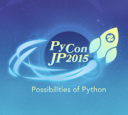
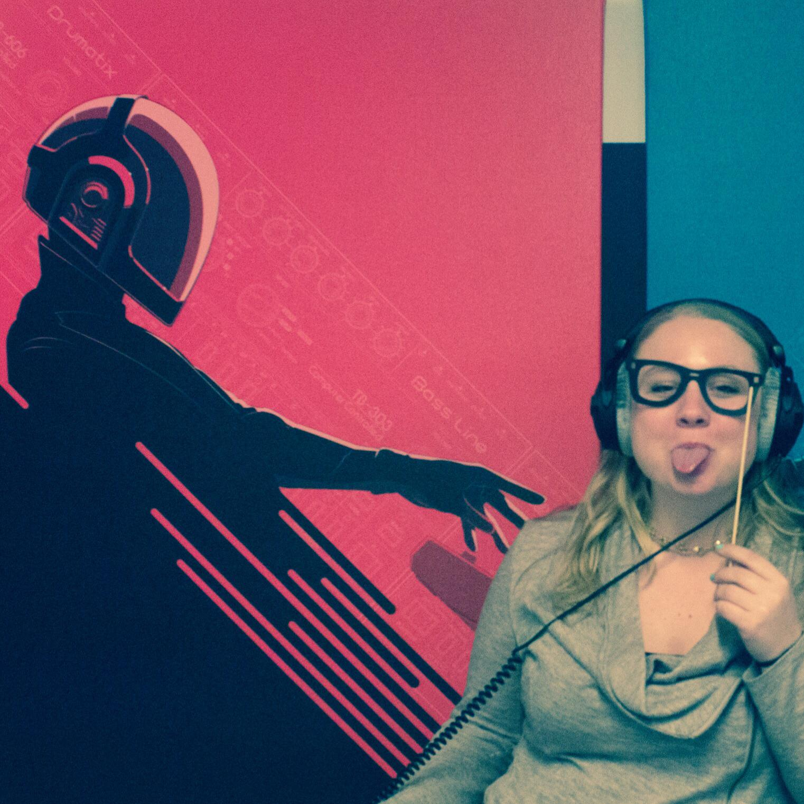
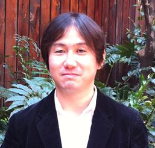

============================================
PyCon JP 2015の作り方 〜プログラムチーム編〜
============================================

こんにちは。メディアチームの芝田です。
PyCon JP 2015 では、現在4つのチームに分かれて様々な準備を行っています。この連載では、各チームがどのように PyCon JP 2015 を作っていっているのかを、それぞれの目線で紹介しています。

第3回目は、プログラムチームについてご紹介します。

プログラムチームの役割
===============================

PyCon JP 2015 プログラムチームの関根です。まずはプログラムチームの役割や担当する内容について紹介します。
プログラムチームでは、おもにカンファレンスで開催される企画の内容を考えたり、各企画を実施するための準備を行っています。
具体的にはキーノートスピーチ、トークセッション、LT、チュートリアル、開発スプリントやその他新企画などを担当しています。
チームメンバーは学生から社会人まで年齢も幅広く、総勢10名位の人数で活動を行っています。

プログラムチームは、カンファレンスのイベントを考える重要な役割を担当しています。できるだけ多くの参加者の方に楽しんで頂けるように、次のような目標を掲げ日々活動しています。

* Pythonの普及と教育に貢献できる
* 新しい発見や学びが得られる
* 参加者同士が交流できる
* コミュニティを知る、参加する、立ち上げるきっかけになる
* 聞くだけではなく参加しているという感覚

PyCon JPは実に様々なバックグランドを持っている方が参加する、国際的なカンファレンスです。
参加者の方には、ただセッションを聞くだけではなく、参加しているという感覚を体験して欲しいと思い、日々奮闘して準備をしています。
今年もたくさんの企画を用意していますので、ぜひ楽しみにしていてください！

2015年のテーマについて
==============================
まずはPyCon JPのテーマについてご紹介します。

PyCon JPでは毎年カンファレンスにテーマを掲げています。今年のPyCon JPのテーマは「Possibilities of Python」です。プログラムチームではイベントや企画を考えるとき、またトークセッションの選定などの際にテーマを中心として考えるようにしています。テーマがはっきりしているため、メンバーが同じ方向を向いてそれぞれの役割を進めることができます。

昨年までは次のようなテーマを掲げていました。こうして並べてみるとテーマにも色々あることがわかります。
すこしユーモアのあるテーマから、真面目なテーマまであり、その年のPyCon JPを表現しているような気がします。

.. list-table:: PyCon JP のテーマ一覧
   :header-rows: 0
   :widths: 40 260

   * - 2011
     - 出会い系Python / Python meet up
   * - 2012
     - つながるPython / Python Connect
   * - 2013
     - The Year of Python
   * - 2014
     - Pythonで再発見 / Rediscover with Python

テーマの決め方
----------------------------

プログラムチームでは一番最初の仕事として、その年のテーマを決定します。今年は1月から実際の活動を始めて2月前半にテーマを決定しました。
テーマの決定は次のような手順で行いました。

* PyCon JP 2015のコンセプト、テーマの募集（PyCon JPスタッフ）
* 募集したコンセプト、テーマを元に打ち合わせ（プログラムチーム）
* テーマの決定（プログラムチーム）

まずは幅広くアイデアを募集する必要があると考え、全スタッフから今年のPyCon JP のコンセプトや、テーマの募集を行いました。
募集に関してはGoogleDocsにてシートを用意して、そこに自由に記述していく方式をとりました。まずはどんなアイデアでも良いので書いてもらい、量を集めることを意識しました。

次に募集したコンセプトとテーマの内容を整理する作業を行いました。まずはコンセプトのグルーピング化を行い、似たようなコンセプトをまとめました。次にどのコンセプトが良いかチームメンバーによる投票を行いました。
その結果、今年のコンセプトとして「将来や未来につながるような方向で行きたい」と決定しました。

コンセプトが決定したので、その内容を元にチームメンバーで話し合いを行いました。
未来や将来につながるようなキーワードが良いと何度も何度も議論を重ね、最終的に今年のテーマである「Possibilities of Python」に決定しました。
「Possibilities of Python」には次のような思いが込められています。

* 可能性という言葉は色々拡げられる
* 昨年の言葉と同じく汎用的に使用できる
* 昨年のRediscover with Pythonから次のステップへ行くイメージ
* 参加者、スタッフ、スピーカーなど色々な人々の状況に合わせて使える
* PyConに関わる人みんなに可能性がある
* ポジティブなイメージ
* プログラムを募集する時、企画を考えるときにアイデアが出しやすい
* コンセプトとして選んだステップや将来の意味も含める
* Pythonを使用すると色々な可能性があるというイメージを膨らませられる

前述のように今年のテーマは「Possibilities of Python」です。プログラムチーム一丸となって様々な企画の準備を進めています。ぜひカンファレンスに参加して、Pythonの可能性を探求しましょう！

キーノートについて
==============================

PyCon JP 2015プログラムチームの齋藤です。キーノートを担当しています。キーノートとは、その会議の基本方針を示す講演のことです。Python界隈で活躍している方をお招きして素晴らしいお話しを聴くことと交流を目的としています。

キーノートスピーカーの紹介
----------------------------

今年のキーノートスピーカーはLynn Rootさんと佐藤治夫さんです。

お二人のプロフィールは `ホームページ <https://pycon.jp/2015/ja/talks/keynote/>`_ より抜粋。

Lynn Root氏
^^^^^^^^^^^

PyLadiesサンフランシスコ支部の創設者。 彼女は、Spotifyへの貢献、Python Software FoundationのボードメンバーやDjango Software Foundationメンバーとして活躍をしています。そんな彼女は、眠らないソフトウェアエンジニアです。

佐藤治夫氏
^^^^^^^^^^^

株式会社ビープラウド代表取締役。
 SIerのシステムエンジニア、フリーランスエンジニアを経て、2006年5月にビープラウドを設立。 ビープラウドでは、2008年4月にPythonを会社の公式言語として採用し、その後、70以上の開発プロジェクトでPythonを採用してきました。

キーノートスピーカーの決定方法
------------------------------

キーノートの候補者の募集はメーリングリストやSNS(Facebookなど)を活用して外部から広く募集しました。候補者決定後、正式な講演者を決定します。講演者の決定までの流れは以下の通りです。

 候補者決定までの流れ
 
 * 1.キーノート候補者の募集
 * 2.PyCon JP 2015メンバーによる候補者の投票と絞り込み
 * 3.絞り込まれた候補者を元にプログラムチーム内で候補者の投票と合意
 * 4.候補者決定
 * 5.決定した候補者にメールで打診
 * 6.スピーカー決定

苦労した点

Lynn Root氏に基調講演の依頼メールは英語でなくてはならないので、英文を作るのに苦労しました。他メンバーの協力によって無事に依頼を出すことができました。
また、英文の依頼メール（抜粋）を公開してみます。海外の方にメールで依頼を出す際の参考になれば幸いです。

Dear ~,

I am Daisuke SAITO, who is a committee member of PyConJP 2015.

I am writing this email to inform you that PyConJP 2015 Conference will be held on 10th-11th of October this year and to ask you if it is possible for you to keynote at the event on 10th in the morning.

This event has been held every year since 2011, and it is one of the largest event about Python in Japan.
545 people who are interested in or are developers of Python participated last year.

The theme of this time is "Possibilities of Python" and The keynote will be for 50 minutes.
We would like to ask you based on a theme your python story. Python developers in Japan welcome you to PyCon JP 2015.

So could you please consider our request?
I am looking forward to hearing from you.

Best regards,

Daisuke SAITO

子ども向けワークショップについて
================================

PyCon JP 2015 プログラムチームの的場です。PyCon JP プログラムチームでは、毎年新しい企画にチャレンジしています。2015年度は、新企画として子ども向けワークショップの開催を企画しています！

新企画の立案
--------------------------------------------
新企画を決定するため、プログラムチーム内ではブレストを行いました。ブレストはGoogleスプレッドシートを使って、メンバーが随時思いついた企画を書き込んでいく方法をとりました。ブレストの中ででてきた、新企画のアイディアの例を紹介します。

 * PyCon JP アワード
 * パネルディスカッション
 * ライブコーディング
 * 自由にかけるボードの配置

いくつかのアイディアがでて来たところで、プログラムチーム内で話し合いをし、採用案を絞り込みます。その中で、今年度のPyCon JPのテーマである「Possibilities of Python」にマッチしており、チーム内でモチベーションの高かった「子ども向けワークショップ」が採用にいたりました。

子ども向けワークショップの想い
--------------------------------------------

どうして今回子ども向けワークショップを開催することにしたのかをはじめに説明します。繰り返しになりますが、PyCon JP 2015のテーマは「Possibilities of Python」（Pythonの可能性・将来性）です。

Pythonはこの記事をご覧の皆さんはご存知の通り、プログラミング言語です。プログラミング言語は、あくまでもソフトウェアを生み出すツールであり、それを使うのは人です。Pythonが今後も利用範囲を拡大し、長く利用されていくためには、多くの人に利用されることが必要になります。Pythonの将来や可能性を広げるため、次の時代を担う子ども達にPythonを知ってもらうことは大切なことです。

そこで、子ども達にPythonに興味をもってもらうきっかけのとして、子ども向けワークショップを開催することにしました。

子ども向けワークショップ開催にあたって
--------------------------------------------

子ども向けのワークショップを開催するにあたって、最初に次の内容を検討しました。

 * 子ども向けワークショップの「子ども」とは？
 * ワークショップの内容はどうするか、またどうやって準備するか？

今回、子ども向けワークショップと題しておりますが、そもそも「子ども」とは、どの年齢を指しているのか、等の議論がありました。プログラミングには、タイピングが必須となります。今回のワークショップでは、Pythonでのプログラミングに興味を持ってもらうことを目的にしています。そのため子ども達には、自分でPythonのプログラムを書いたり、修正したりしてもらいたいと考えています。そうなると、ある程度のタイピングを行えることが参加資格としてあがりました。また、あまりに幼いと理解が追いつかないことや収拾がつかなくなる可能性があることから、参加者の年齢は小学校５年生以上から高校生までを対象とする方針としました。

ワークショップの具体的内容については、現状のPyCon JPスタッフだけで、実施すると手に負えない可能性が高く、外部団体のTENTOさん（http://www.tento-net.com/）と協力体制を組んで進めていく方針としました。また、どのようなモノを題材とするかという話の中で、業務系かエンターテイメント系かと言った議論があり子どもに興味を持ってもらうという観点や、外部団体の準備の容易さからエンターテイメント系の内容を題材とする方向性としました。また、外部団体と組んでいくことが検討されると同時にワークショップの開催日、予算、会場、参加人数などについても同時に検討が進みました。

協力体制を組む外部団体には、Pythonを利用したプログラミング教育のノウハウをもつ協力団体を探しました。日本国内に、Pythonでプログラミング教育ノウハウをもつ団体は少ないのですが、PyConスタッフの推薦もありTENTOさんと組んでいくことが決定しました。

TENTOさんと具体的な内容を詰めていく中で、とあるゲームをPythonから操作し、幾何学図形を操る題材の提案をいただきました。それらをPyCon JPスタッフで検討した結果、自分が書いたプログラムで何かが動くというプログラミングの楽しさを感じてもらうのに非常に良い題材だと判断し、採用に至りました。

ワークショップの開催日について、子どもを対象としていることから、学校のある平日の開催は避けることがあがり、同時にPyConというカンファレンスの雰囲気を体感してもらいたいという思いからカンファレンスデーの日曜日に開催としました。

PyCon JPでの子ども向けワークショップ開催の難しさ
------------------------------------------------

まず、子ども向けワークショップを開催するには、子ども向けにプログラミングのワークショップを行うノウハウが必要になります。今回は、その問題を外部団体のTENTOさんと協力することで解決しています。
また、子ども向けワークショップは、PyCon JPの中で開催する一つのイベントではありますが、参加者はPyCon JP本体とは別枠で募る予定です。そのため、子ども向けワークショップのイベントとしての規模は、PyCon JP本体より小さいものの、対応範囲としては、出し物と会場を準備するだけでなく、イベント広報や当日の受付、参加費の集金など、広範囲に及びます。また、外部団体と組んでいくことにより、調整事項や検討事項は多岐に上ります。それらを管理したり外部との認識を合わせていくことの難しさが、今回の子ども向けワークショップのようにイベント内でイベントを外部団体と組んで開催する難しさではないでしょうか。その解決策として、次のような内容に取り組んでいます。

 * 打ち合わせ内容は可能な限り、議事録として残す。
 * 確認事項や対応内容は、BTS（Bug Tracking System）で管理する。

口頭で話した内容を議事録に残していない場合、参加者の記憶にズレが出ると認識がズレることになります。その結果、何度も同じ話をすることになりますので、議事録をとることを心がけています。また、PyCon JPスタッフは、別に仕事を持っている方がほとんどですので、打ち合わせ終了時点で議事録が完成するように、打ち合わせをしながら議事録を作成していきます。打ち合わせなどで見つかった確認事項であったり対応内容は、BTSでチケットとして発行して管理しています。これは、後々に、何が確認できているかの追跡を容易にすることと、課題の担当者や対応者を明確にすることなどの意図があります。このようにいくつかの工夫を重ねながら、新企画の成功に向けて取り組んでいます。

まとめ
======

メディアチームの芝田です。
このようにしてプログラムチームでは、PyCon JPの企画の準備を進めています。今年も様々な企画を用意しています。お楽しみに！

次回は、事務局チームの準備を担当者に紹介してもらう予定です。それでは、次回の更新をお楽しみに！

