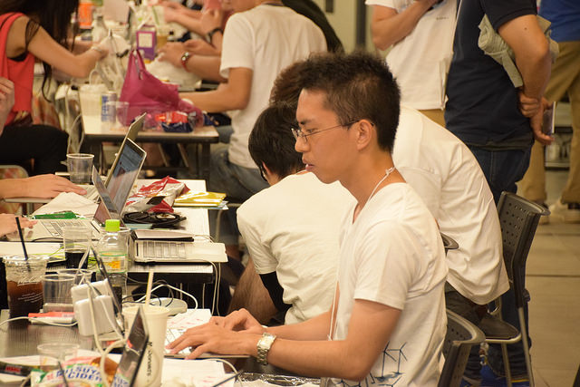
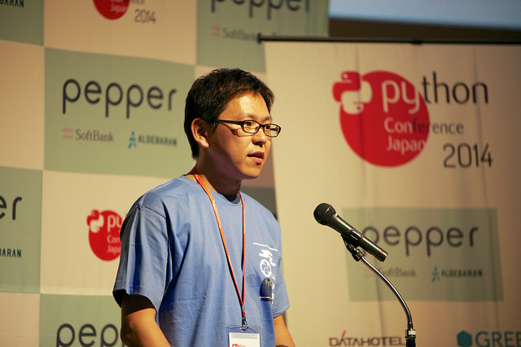

========================
 第2回 プログラムついて
========================

こんにちは、メディアチームの芝田です。

この連載では、PyCon JP 2015の開催に先駆けて、カンファレンスの概要から見どころまでを紹介しています。
第2回はPyCon JP 2015の目玉であるプログラムを紹介していきます。

プログラム概要
==============
プログラムチームの清田です。

PyCon JP 2015のテーマは、「Possibilities of Python」。可能性を感じてもらえるような内容にしていきたいと考えています。

一日目は、PyCon JP 初、女性の `Keynote <https://pycon.jp/2015/ja/talks/keynote/>`_ をお招きします。どんなお話が聞けるのか今から楽しみです。また、女性繋がりになってしまいますが、一日目は `PyLadies Tokyo <http://pyladies-tokyo.connpass.com/>`_ を中心にコミュニティーについてのパネルディスカッションも企画しています。女性コミュニティーも活発になってきています。今後の発展に期待したいところです。

二日目は、 `子ども向けワークショップ <https://pycon.jp/2015/ja/events/kids-ws/>`_ を朝から開始します。初の試みですので、どんな内容になるか非常に楽しみです。継続した企画になると良いなと個人的には思っています。

他にも、チュートリアル、LT、ポスターセッションなど盛りだくさんの企画を考えているので、ご期待ください。

トークセッション・ポスターセッション
====================================
プログラムチームの中山です。

今年の `トークセッション <https://pycon.jp/2015/ja/schedule/talks/list/>`_ では英語と日本語合わせて約30ものトークが用意されています。100以上ものトークから審査を通過した選りすぐりのトークで、英語と日本語の割合は1:2ほどになっております。

テーマである「Possibilities of Python」に沿った多種多様なトークがあり、プログラミングの話など定番なテーマから3Dプリントやロボットと強化学習の例といった専門性の高いテーマまで、今まで知らなかったPythonの活用方法が盛り沢山です。

PyCon JP 2015では様々なトークの中から選んで参加するプログラムを準備しています。当日は、目当てのトークを見つけていただき、実りの多い時間を過ごして頂けたらと思います。

ポスターセッションも去年に続き行います。この記事が公開されるころぐらいには、どのような発表があるか決まっていると思います。こちらも、是非期待して頂けたらと思います。

チュートリアル
==============
プログラムチームの佐藤(昌)です。

今年もカンファレンスの前日にPythonに関する有料のチュートリアルを開催します。今年は昨年よりも倍の6つに増え、扱うテーマも、初心者向けPythonチュートリアルをはじめ、データ分析、統計、機械学習、IoT、ドキュメンテーションなど、多岐に渡った内容となっています。是非ご参加ください。

詳細については `チュートリアルページ <https://pycon.jp/2015/ja/schedule/tutorials/list/>`_ にてご確認ください。

参加登録は `PyCon JP 2015 チュートリアル チケット購入ページ <http://pyconjp.connpass.com/event/18811/>`_ からお願いします。 チュートリアルへご参加いただくには、 `PyCon 2015 のチケット <http://pyconjp.connpass.com/event/15146/>`_ とチュートリアルのチケットの両方が必要になります。チュートリアルのみへの参加はできません。

チュートリアルの詳細を下記に紹介します。

概要
-----

.. list-table::
   :widths: 30 70
   :stub-columns: 1

   * - 日付
     - 2015年10月9日(金)
   * - 時間
     - - 午前 10:00-13:00
       - 午後 14:00-17:00
   * - 会場
     - 東京国際交流館プラザ平成
   * - 募集人数
     - 100人程度
   * - 参加費用
     - - 午前券（午前のチュートリアルの中から1つ選択） 5,500円
       - 午後券（午後のチュートリアルの中から1つ選択） 5,500円
       - 1日券（午前、午後のチュートリアルの中からそれぞれ1つずつ選択） 11,000円

午前 10:00-13:00
-----------------

【初心者向けPythonチュートリアル】Webスクレイピングに挑戦してみよう
-------------------------------------------------------------------
Pythonを初めて学ぶ方や始めたばかりの方を対象としたチュートリアルです。Pythonの環境構築、データ型、ファイル操作、ライブラリなど、基本的な使い方を学べる内容となっています。また、後半では今後の業務などに役立てられるような実践的な内容も学ぶことができます。

講師の `Takesxi Sximada <https://twitter.com/TakesxiSximada>`_ さんに意気込みを伺いました。

| 本チュートリアルではPythonの基本的な扱い方とその応用の一例としてWebスクレイピングを学びます。
| 学んだ事を実践に生かせる内容になるように、HTTP通信やHTML/JSON/CSVなどのデータ形式を扱うようにしました。
| 業務での応用をイメージできるようなチュートリアルになるように頑張ります。

Machine Learning Bootstrap
--------------------------
Pythonを利用して、機械学習を組み込んだアプリケーションを作成したい方を対象としたチュートリアルです。機会学習はそもそも何ができるのかというところから、具体的にPythonを使って実装するところまでを学べる内容となっているので、これから機会学習を初めたい方にはぴったりの内容となっています。

講師の `Takahiro Kubo <https://twitter.com/icoxfog417>`_ さんに意気込みを伺いました。

| 本チュートリアルでは、機械学習を組み込んだアプリケーションを実際に触ってもらい、その動作原理や実装方法について解説していきます。
| これを機に、機械学習という力でいろいろなアイデアを実現する方法を身につけてもらえればと思います。

Sphinxハンズオン
----------------
Sphinxでドキュメントを作成したい方やもっと詳しく学びたい方を対象としたチュートリアルです。ハンズオンを通じて基本的な文法やビルドについて学べる内容となっています。また、講師はPythonのSphinxのコミッタである清水川さんだけでなく、著名な方々が講師としていらっしゃいます。

講師の `Takayuki Shimizukawa <https://twitter.com/shimizukawa>`_ さんに意気込みを伺いました。

| Sphinxはドキュメントを作りたくなってしまう魔法のツールです。
| ドキュメントを手軽に書けるようになり、そして書くのが楽しくなります。
| ハンズオンでは、Sphinxのインストールからはじめていき、ドキュメント作りの楽しさをみなさんにお伝えしたいと思います。

午後 14:00-17:00
-----------------

Pythonを使った機械学習入門
--------------------------
Pythonを使った機械学習に興味がある方を対象としたチュートリアルです。ハンズオン形式で、NumPy, SciPy, matplotlib, scikit-learnを使って実際にコードを書きながら学んでいくことができます。午前の部にも機会学習のチュートリアルがありますが、午後でも機会学習を基礎から学習するすることができます。

講師の `Kimikazu Kato <https://twitter.com/hamukazu>`_ さんに意気込みを伺いました。

| 本チュートリアルでは、機械学習の入門的説明から始め、実際に手を動かしながら機械学習の評価実験を実行するところまでやります。機械学習というと難しいイメージを持っている人もいるかもしれませんが、特に専門知識を仮定せず、数式はほとんど使わずにできるだけ平易に説明しようと思っています。幅広いバックグラウンドの人たちの参加を期待しています。

エンジニアのためのベイズ推定入門：確率論的プログラミングのすすめ
----------------------------------------------------------------
Pythonで統計解析を学びたい方を対象としたチュートリアルです。Pythonコードを動かしながら確率論的プログラミングを体験することができます。数学的なアプローチは少なめで、実際にPythonのコードを書いて結果をグラフに描画しながら学ぶことができるので、これから学ぼうとしている方も楽しく統計解析を学ぶことができるのではないでしょうか。

講師の `Yuta Kashino <https://twitter.com/yutakashino>`_ さんに意気込みを伺いました。

| モダンな統計解析や機械学習の前提知識であるベイズ推定について、事前分布、事後分布、マルコフ連鎖などの概念に翻弄されている技術者を対象として、ベイズ推定を行うための基礎とを身につける講座です。Pythonコードを動かしながらべイズ推定の肝を理解し、確率論的プログラミングを体験することを目指します。

Python x Edison x AWSではじめる IoT
------------------------------------
IoT(Internet of Things)領域の技術を身につけたい方を対象としたチュートリアルです。チュートリアルでは、デバイスからセンサーデータを収集したり、AWSのサービスにアップロードしたりをハンズオン形式で学ぶことができます。Pythonを使いながらデバイスを扱うことができるので、普段では中々できないような体験ができると思います。

講師の `Takahiro Ikeuchi <https://twitter.com/iktakahiro>`_ さんに意気込みを伺いました。

| 本チュートリアルは、これからIoTを学び始める第一歩として最適です。IoTの技術要素を学ぶには、デバイスと、デバイスの通信先となるサービスが必要です。本チュートリアルは、参加者の方がPythonのコードを書けば実際にIoTの面白さを体験できるよう、必要な環境を提供します。
| Python x IoT x AWSの可能性を体感できる身のあるチュートリアルとなるよう絶賛準備中です。当日、みなさまとお会いできることを楽しみにしています。

その他のプログラム企画
======================
プログラムチームの的場です。

PyConJPでは今年度の新企画として、子ども向けワークショップを開催します。今年のPyConJPのテーマは、「Possibilities of Python」（Pythonの可能性・将来性） です。Pythonの将来や可能性を広げる子どもたちにPythonを触ってもらい、Pythonを知ってもらおうというが本企画の趣旨です。

今回は、マインクラフトの世界でPythonを利用したプログラミングを行うことでPythonを知ってもらえるように進めていきます。ワークショップでは、簡単なプログラムからはじまり、少しずつ複雑な形を作っていきます。

今回のワークショップでは、参加対象者を小学生高学年から高校生と幅広く設定しています。また、参加本人に意欲や能力があれば小学校低学年の方でも参加を認めています。そのため、当日のワークショップでは参加者によって進み具合に差が出ることが予想されますので、それらを吸収できるようテキストで資料を配布する等、個人で進み具合を調整する可能なようにワークショップを進めていく形としています。

また、子ども向けワークショップの開催には、子ども向けプログラミング教育のプロである外部団体のTENTOさん（http://www.tento-net.com/）と協力体制を組んで進めており、可能な限り親御さんに安心いただいた上でワークショップを開催できるよう、進めております。

Pythonは、様々なことができプログラミングしていて気分がいい言語です。是非、この機会を利用して子どもたちに、Pythonについて知ってもらえれば嬉しいなと考えております。また、ワークショップ当日は、他のPyConJPのイベントに参加できますので、あわせてPyConJPの空気感を楽しんでいただければより、嬉しい限りです。

まだ、ワークショップの参加枠には空きがありますので、気になる方はお早めにお申し込みください！
詳細はこちら（https://pycon.jp/2015/ja/events/kids-ws/）

まとめと次回
============

メディアチームの芝田です。

みなさん多くのプロポーザルの堤出ありがとうございました。
PyCon JPのプログラムはスタッフだけではなく、みなさんのご協力が必要不可欠です。
PyCon JP 2015のスタッフはみなさんの発表を全力でサポートいたします。

次回はPyCon JPの会場やパーティ、提供するランチについて紹介していきます。
次回の更新をお楽しみに！
