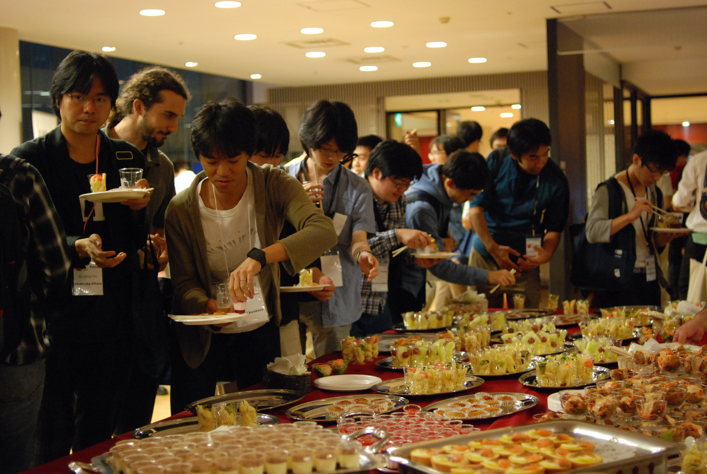
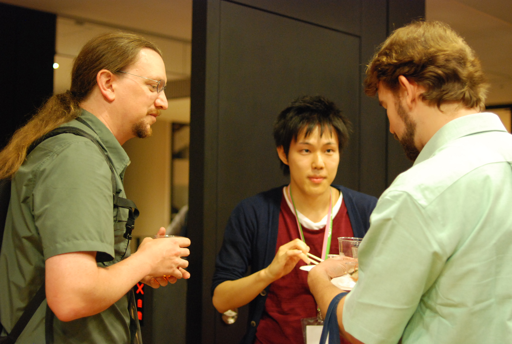

==============================
 第3回 会場・パーティについて
==============================

こんにちは、メディアチームの芝田です。

この連載では、PyCon JP 2015の開催に先駆けて、カンファレンスの概要から見どころまでを紹介しています。
第3回はPyCon JPの会場やパーティ、提供するランチについて紹介していきます。

会場
====

会場チームのナツです。
PyCon JP 2015は、昨年同様 東京国際交流館 プラザ平成で開催します。東京のお台場に位置し、近くには日本科学未来館、船の科学館、ダイバーシティなどの施設があります。
今年はチュートリアルもこちらの会場での開催となりますが、最終日のスプリントだけは別会場となりますのでご注意ください。
セッションに利用する国際交流会議場やメディアホールは、会議だけでなく映画上映やコンサートホールとしても利用されており、セッションに集中できる環境です。また、会場全館を貸切りで利用するので、コミュニケーションやちょっと疲れた際の休憩に利用できるスペースが豊富です。天気が良ければ、2階のテラスも開放予定です。

アクセス
---------
ゆりかもめ「船の科学館」駅より徒歩3分, りんかい線「東京テレポート」駅より徒歩15分の位置にあります。便数が限られますが、都営バス「船の科学館駅前」バス停も利用可能です。当日は混雑が予想されますので、なるべく早めのご来場にご協力お願い致します。
　詳しいアクセス方法については、PyCon JP 2015 サイトへ記載しておりますので、ご確認ください。

注意点
---------
会場を安全に利用するにあたり、参加者のみなさんにはいくつかお願いがあります。
毎年、基調講演開始直前に受付が混雑します。早めにお越しいただき、混雑の緩和に協力をお願いします。ぜひ前の方から詰めてお座りください。
受付と会場の間に細いエスカレーターがあります。当日朝は混雑が予想されますが、エスカレーターでは歩かずに、1段ずつ空けて乗るようにしてください。
会場のゴミ箱に限りがあります。会場で提供の昼食やおやつについては回収しますが、個人のゴミは持ち帰りにご協力をお願いします。

ライブ配信
----------
会場へ来られない方のために、今年もすべてのトークセッションをYouTubeでライブ配信します。聞き逃した、聞きたいが時間帯が被ってしまった場合にも、後日録画のリンクをサイトに掲載する予定です。ぜひご利用ください。

パーティー
==========

会場チームの新井です。

パーティーまで含めてPyCon JP 2015という一つのイベントであるという思いで、今年は去年同様パーティー込みのチケットとしています。
カンファレンス会場と同じ場所でそのまま行いますので、移動の手間なくスムーズにパーティーを楽しんで頂けるかと思います。

   2014年のパーティーの様子

パーティーの形式は例年同様、立食形式です。スピーカー／スポンサー／一般参加者の垣根なく、気軽にたくさんの方々と交流できるような場を提供できればと考えています。
料理に関しては、味・ボリュームともに満足頂けるものをスタッフ内での試食を経てメニューを決定しました。またランチ同様、通常のメニュー以外にベジタリアンやハラール向けのメニューも用意しています。

飲み物は、アルコールが好きな方も得意でない方、未成年の方皆様が同様に楽しめるよう、種類を充実できるように取り組んでいます。

今年はこのようなパーティーを準備しています。カンファレンス1日目の締めとして素晴らしい夜にできるよう努めていますので、皆様お楽しみに！

   パーティーでの交流の様子

ランチ
======

メディアチームの今津です。当日のランチのご案内です。

今年のランチは、1Fのテラスでの配布を予定しています。中身はまだ決まっていませんが、例年に負けないくらい美味しいランチを選ぶ予定ですので、楽しみにしておいてくださいね。
ランチの受け取りですが、最初は少し混雑してしまうかもしれないので、できるだけ余裕を持ってお越し下さい。
受け取った後は、飲食禁止の場所以外であれば自由に移動して食事していただけますので、話してみたかった方や当日知り合った方と一緒に食べてワイワイしてもらえればと思います。

.. figure:: _static/03_venue_party/lunch_20140914.jpg
   :width: 600
   :alt: 2014年のランチの様子

   2014年のランチの様子

また、ランチタイムと同時にオフィスアワー(両日)やポスターセッション、ジョブフェアー(2日目)が開催されます。ぜひお気軽に見に行っていただければと思います。

まとめと次回
============

メディアチームの芝田です。

会場は昨年と同じです。
非常に広いため昨年のPyCon JPに参加ていない方は確認しておくと良いと思います。
また昨年のランチは非常に美味しいと評判でした。今年のランチも期待ですね！

最終回となる次回の連載では、これまで紹介しきれなかった見どころについて書いていきます。
次回の更新をお楽しみに！

