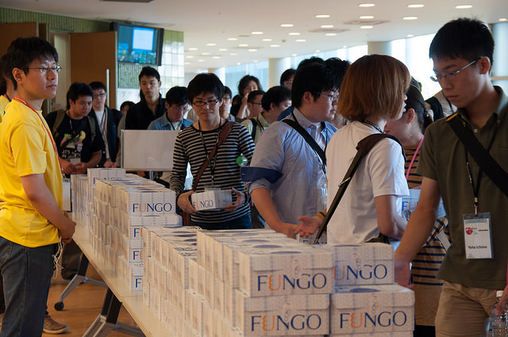

==============================
 第3回 会場・パーティについて
==============================

こんにちは、メディアチームの芝田です。

この連載では、PyCon JP 2015の開催に先駆けて、カンファレンスの概要から見どころまでを紹介しています。
第3回はPyCon JPの会場やパーティ、提供するランチについて紹介していきます。

会場
====
- 担当: 会場チーム

ネットワーク・無線LAN環境
=========================
- 担当: 会場チーム

パーティー
==========

会場チームの新井です。

パーティーまで含めてPyCon JP 2015という一つのイベントであるという思いで、今年は去年同様パーティー込みのチケットとしています。
カンファレンス会場と同じ場所でそのまま行いますので、移動の手間なくスムーズにパーティーを楽しんで頂けるかと思います。
　　
パーティーの形式は例年同様、立食形式です。スピーカー／スポンサー／一般参加者の垣根なく、気軽にたくさんの方々と交流できるような場を提供できればと考えています。
料理に関しては、味・ボリュームともに満足頂けるものをスタッフ内での試食を経てメニューを決定しました。またランチ同様、通常のメニュー以外にベジタリアンやハラール向けのメニューも用意しています。

飲み物は、アルコールが好きな方も得意でない方、未成年の方皆様が同様に楽しめるよう、種類を充実できるように取り組んでいます。

今年はこのようなパーティーを準備しています。カンファレンス1日目の締めとして素晴らしい夜にできるよう努めていますので、皆様お楽しみに！

ランチ
======

メディアチームの今津です。当日のランチのご案内です。

今年のランチは、1Fのテラスでの配布を予定しています。中身はまだ決まっていませんが、例年に負けないくらい美味しいランチを選ぶ予定ですので、楽しみにしておいてくださいね。
ランチの受け取りですが、最初は少し混雑してしまうかもしれないので、できるだけ余裕を持ってお越し下さい。
受け取った後は、飲食禁止の場所以外であれば自由に移動して食事していただけますので、話してみたかった方や当日知り合った方と一緒に食べてワイワイしてもらえればと思います。

また、ランチタイムと同時にオフィスアワー(両日)やポスターセッション、ジョブフェアー(2日目)が開催されます。ぜひお気軽に見に行っていただければと思います。

まとめと次回
============

メディアチームの芝田です。

会場は昨年と同じです。
非常に広いため昨年のPyCon JPに参加ていない方は確認しておくと良いと思います。
また昨年のランチは非常に美味しいと評判でした。今年のランチも期待ですね！

最終回となる次回の連載では、これまで紹介しきれなかった見どころについて書いていきます。
次回の更新をお楽しみに！

